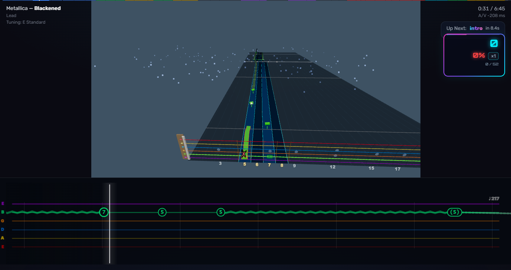
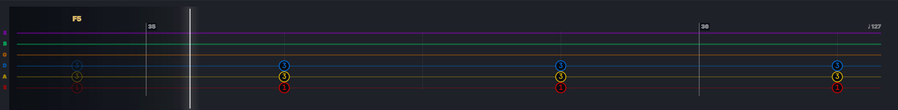
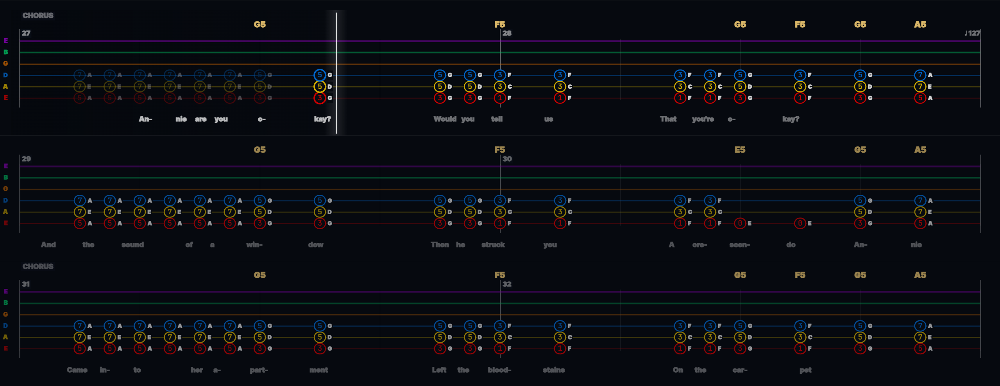
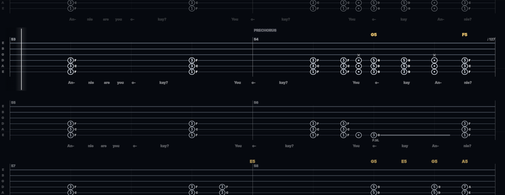
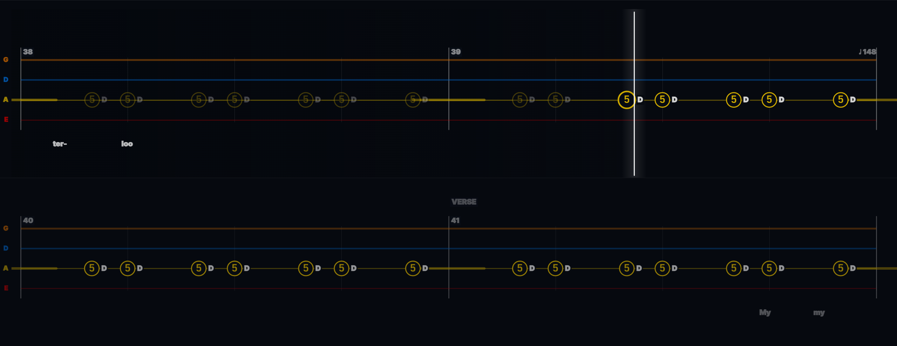

# Live Tab

A tablature you can actually read while it moves, for [fee[dB]ack](https://github.com/got-feedback).

Live Tab sits between the views that already ship with the game. Tab View draws
real tab, but as static pages with a cursor that jumps. Jumping Tab is fully
game-like: gems fly at a hit line and there is no tab left to read. Live Tab
keeps the tab legible while it moves, hosts any note board above it, and shows
the same hit/miss verdicts the board shows — so the feedback lands where you are
already looking.



*The note board keeps the upper part of the player, the tab takes the lower —
neither covers the other.*



*The staff itself: one line sliding under a fixed cursor, chord names above,
note names beside the frets.*

**Status: alpha.** It has been used on a library of about forty converted charts. If it
does something odd on one of yours, the settings panel has a **Copy
diagnostics** button — paste what it gives you into the bug report and the chart
can be diagnosed without anyone having to own it.

What changed between versions is in the [changelog](CHANGELOG.md).

---

## Install

Your fee[dB]ack plugins directory is:

| | |
|---|---|
| Windows | `…\Feedback\resources\slopsmith\plugins\` |
| Linux / macOS | the `resources/slopsmith/plugins/` folder inside your install |

### With git — recommended

```
cd …/plugins
git clone https://github.com/cracklydisc/feedBack-plugin-livetab.git livetab
```

Then restart fee[dB]ack, start a song, and pick **Live Tab** in the
visualization picker.

Installed this way the app can update it for you: **Plugins → Check for
Updates** finds new versions and installs them with one click. Installed any
other way it cannot, and you will only hear about a new version if you happen
to see it announced.

### Without git

Green **Code** button → *Download ZIP*, unpack it, and rename the unpacked
folder to `livetab` inside your plugins directory. You should end up with
`…/plugins/livetab/plugin.json`. Restart fee[dB]ack.

Updating means downloading again and replacing the folder.

---

Requires fee[dB]ack **0.3.0-alpha.1** or newer (it uses the v3 player's plugin
control slot and the `/api/plugins` list). On an older build the tab still
draws; only the in-player control pill goes missing.

To uninstall, delete the `livetab` folder and restart.

---

## Two ways to read

**Scrolling** — one continuous staff sliding under a fixed cursor, with a note
board hosted above it. Nothing to lose your place in.

**Page turns** — how sheet music reads. Each staff holds a fixed number of bars,
the cursor crosses it, and at the end the stack slides up by exactly one staff.
Nothing moves mid-bar, so the numbers hold still while you play them, and the
staves below already show the bars to come.



*Page turns, three staves: note names beside the frets, lyrics under the notes
they fall on, string names down the left margin.*



*Sight-reading: the same page turns in one ink, the way tab is printed.*



*Four strings on a bass chart, and the margin naming the open strings from the
song's own tuning.*

Both are reached from the presets: **Live**, **Study**, **Sight-reading**,
**Arcade**, **Minimal**. Start there; the advanced options are folded away
underneath and every one of them is optional.

---

## What it draws

Positions are measured in beats rather than seconds, over a cleaned copy of the
chart's beat grid. Note spacing is therefore proportional to note value — a
quarter really is twice an eighth, in a slow song and a fast one alike — and the
tab advances at one beat per beat, locked to the music rather than to the clock.

- **Notation** — slides leave the played fret on a fading band and arrive at a
  hollow head, dashed when unpitched; hammer-ons and pull-offs are an arc
  joining the two notes they link; harmonics wear a diamond, filled for pinch;
  vibrato waves along the sustain; bend depth reads as ¼, ½ or full; palm mute
  is one `P.M.` with a dashed span; accents, taps and fret-hand mutes share a
  row above the head; a linked note is parenthesised, because it is held rather
  than struck again.
- **Rhythm** — the staff is ruled at whole beats, and at halves and quarters of
  a beat where there is room to tell them apart. Spacing is already
  proportional to note value, so this is simply something for the eye to count
  against; each weight is fainter than the last, so the lines are there to be
  landed on rather than read.
- **The loop** — arm one and the stretch that repeats is shaded on the staff,
  with the point it turns marked, in the same green as the app's loop buttons.
- **Around the staff** — bar numbers, section names, chord names and the tempo,
  each in a lane of its own so a chord change on a downbeat never prints through
  a bar number. The open note of every string runs down the left margin, read
  from the song's own tuning, so a drop or a half-step-down tuning says what it
  is. Lyrics can run under the staff, syllable under the note it lands on.
- **Hit and miss** — from the host's own note-state provider, so a fret number
  turns green or red in the tab in the same frame the gem does. This needs note
  detection running with your instrument connected.
- **Colour** — follows the per-string palette from the app's Graphics settings,
  so one palette serves every view. Or ignore it, print in a single ink like tab
  on paper, or fill the heads like the board's gems.

Four to eight strings, guitar or bass, with the staff able to draw your
instrument's extra low string as an empty line so a string is one line in both
places.

---

## The look comes from a kit

The panel in the player and the whole settings screen are drawn with the
[fee[dB]ack plugin kit](https://github.com/cracklydisc/feedBack-plugin-kit) — a
small design system with its own tests and its own
[DESIGN.md](https://github.com/cracklydisc/feedBack-plugin-kit/blob/main/DESIGN.md),
where every control is chosen by the shape of the value it edits rather than
picked by hand.

The kit is **vendored, not imported**: copied into `src/kit/` and
`assets/kit.css` rather than fetched from another plugin at runtime, because
any plugin can be disabled and there is no load order to rely on.

[Riff Repeater](https://github.com/cracklydisc/feedBack-plugin-riffrepeater)
draws from the same kit, which is why the two plugins look like one object
rather than two things that resemble each other — and why a drill armed there
shows up here as a loop you can read.

---

## Reporting a problem

Settings → Graphics → **Live Tab** → **Copy diagnostics**, then paste. It
reports the plugin version, what it found in the host, and what the chart looks
like from the inside — string count, tuning offsets, and how ragged its beat
grid was before cleaning. A screenshot showing the bar you were on is worth
adding.

From a browser console, `livetab.diag()` returns the same object, and
`window.livetab` exposes `get`, `set`, `reset`, `presets`, `applyPreset`,
`boards` and `schema` if you want to script it.

---

## Licence

AGPL-3.0, matching fee[dB]ack itself. See [LICENSE](LICENSE).
